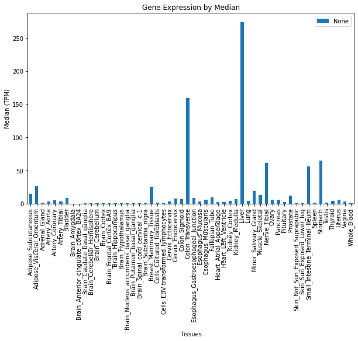
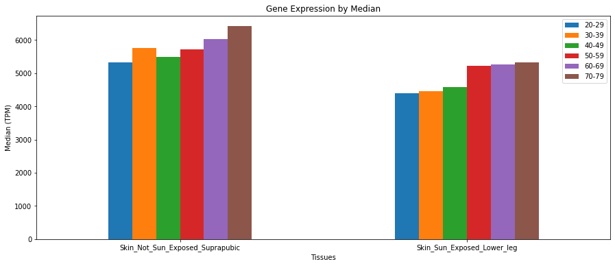
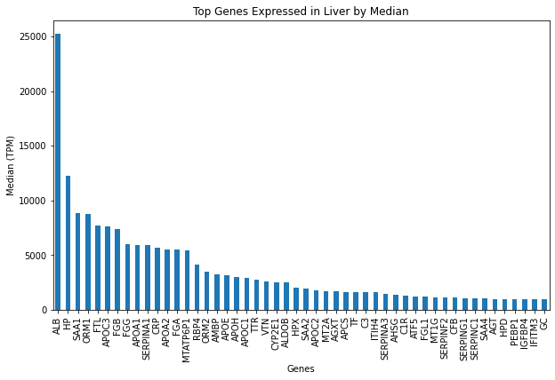
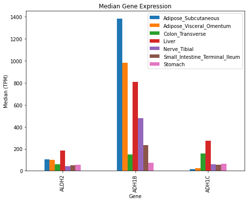
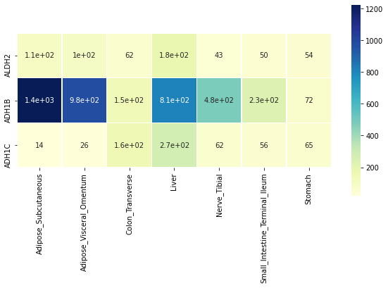

# pyGTEx

pyGTEx is a module that aims to provide multiple wrappers that allow for ease of access to data pertaining to gene expression in tissues. 

**NOTE: This project is not affiliated with the Genotype-Tissue Expression (GTEx) Project.**


## Installing pyGTEx

pyGTEx is available at https://github.com/w-gao/pyGTEx and can be installed by the following command: 
```
pip install git+https://github.com/w-gao/pyGTEx.git
```


## Module Design

<image src='images/design_chart.png' />


## Examples

### Exploring Available Tissues - TissuesInfoModel

Here is an example of using one of our Models where we fetch all tissues that are supported by GTEx:


```python
# Import pyGTEx like this
import pygtex

# instantiate a TissuesInfoModel, HTTP requests and parsing are taken care of behind the scenes. 
tModel = pygtex.TissuesInfoModel()
tissues = tModel.getTissues('tissueSiteDetailId')
```

#### What `tissues` looks like

The first 10 of 54 identified tissue sites in the body are displayed in the table below.


```python
import pandas as pd
df = pd.DataFrame(tissues[:10], columns=['Tissues'])
df
```

<div>

<table>
  <thead>
    <tr style="text-align: right;">
      <th></th>
      <th>Tissues</th>
    </tr>
  </thead>
  <tbody>
    <tr>
      <th>0</th>
      <td>Adipose_Subcutaneous</td>
    </tr>
    <tr>
      <th>1</th>
      <td>Adipose_Visceral_Omentum</td>
    </tr>
    <tr>
      <th>2</th>
      <td>Adrenal_Gland</td>
    </tr>
    <tr>
      <th>3</th>
      <td>Artery_Aorta</td>
    </tr>
    <tr>
      <th>4</th>
      <td>Artery_Coronary</td>
    </tr>
    <tr>
      <th>5</th>
      <td>Artery_Tibial</td>
    </tr>
    <tr>
      <th>6</th>
      <td>Bladder</td>
    </tr>
    <tr>
      <th>7</th>
      <td>Brain_Amygdala</td>
    </tr>
    <tr>
      <th>8</th>
      <td>Brain_Anterior_cingulate_cortex_BA24</td>
    </tr>
    <tr>
      <th>9</th>
      <td>Brain_Caudate_basal_ganglia</td>
    </tr>
  </tbody>
</table>
</div>


### Exploring GenesModel

If you would like to get information on one or multiple genes, you can do that using the GeneModel or GenesModel, which allows query of genes based on gene symbols or genecode Ids. 


```python
gene = 'ace2'
gModel = pygtex.GeneModel(gene)

print('Input gene:', gene)
print(' - GeneSymbol:', gModel.getGeneSymbol())
print(' - GencodeId:', gModel.getGencodeId())
print(' - EntrezGeneId:', gModel.getEntrezGeneId())
```

    Input gene: ace2
     - GeneSymbol: ACE2
     - GencodeId: ENSG00000130234.10
     - EntrezGeneId: 59272


### Visualization with GTExVisuals

GTExVisuals comes with the pyGTEx installation, and it is our application of pyGTEx to allow for further ease in visualization by giving the user the option to generate Newick trees, heatmaps, or bar graphs depending on the type of gene and/or tissue data given.


```python
# Import the module like this
import GTExVisuals
```

#### plotGeneExpression

Explore the tissues where a gene is most expressed


```python
# ADH1C is a cool gene

# "Variants in the DNA coding for ADH can affect how quickly a person converts alcohol into acetaldehyde"
# https://blog.helix.com/alcohol-effects-the-weekly-gene-adh1c/

GTExVisuals.plotGeneExpression('ADH1C', tissues, figsize=[10, 6], sortBy=None)
```





```python
# Age related expression

# "Age spots have abnormally high levels of expression of KRT5"
# https://www.ncbi.nlm.nih.gov/pmc/articles/PMC5342934/#!po=82.1429
skinTissues = ["Skin_Not_Sun_Exposed_Suprapubic", "Skin_Sun_Exposed_Lower_leg"]
GTExVisuals.plotGeneExpression('KRT5', skinTissues, figsize=[15, 6], sortBy="ageBracket", rot=0)
```





#### plotTopExpressedGene

See what genes are top expressed in a tissue site.


```python
GTExVisuals.plotTopExpressedGene('Liver', filterMtGene=True, figsize=[10, 6])
```





#### plotMedianGeneExpression

We can visualize median gene expression data from multiple Gencode IDs on particular tissues.


```python
genesOfInterest = ['ALDH2', 'ADH1B', 'ADH1C']
tissuesOfInterest = ['Liver', 'Colon_Transverse', 'Nerve_Tibial', 'Small_Intestine_Terminal_Ileum', 'Stomach', 'Adipose_Subcutaneous', 'Adipose_Visceral_Omentum']

GTExVisuals.plotMedianGeneExpression(genesOfInterest, tissueIds=tissuesOfInterest, figsize=[8, 6])
```





#### plotMedianGeneExpressionHeatmap

We can visualize median gene expression data with a heatmap.


```python
GTExVisuals.plotMedianGeneExpressionHeatmap(genesOfInterest, tissueIds=tissuesOfInterest, figsize=[10, 5])
```





## LICENSE

Copyright (C) 2022 William Gao and Rose Delvillar, under the MIT license.

